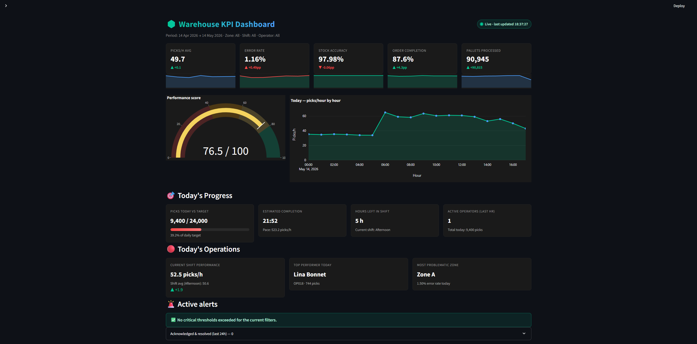

# 📦 Warehouse KPI Dashboard

Interactive web dashboard that simulates a live logistics warehouse and surfaces its KPIs in near-real-time. Synthetic data generated over 30 days, auto-refresh every 60 seconds with live ticks appended on each refresh, severity-scored alerts with acknowledge workflow, and a polished dark UI.


## 📸 Screenshot

<!-- Place a real screenshot in docs/screenshot.png and uncomment the line below -->
<!--  -->

> _Screenshot placeholder — capture the running dashboard and drop the image at `docs/screenshot.png`._

## ✨ Features

- **Live simulation** — auto-refresh every 60 s, new live row appended to the dataset on each tick
- **Pulsing live indicator** + `Last updated HH:MM:SS` timestamp in the header
- **5 headline metric cards** with delta vs previous period and 7-day sparklines
- **Performance Score gauge** — weighted composite (40% picks/h · 30% accuracy · 20% errors · 10% completion)
- **Today's Progress** — picks completed vs daily target (1 200 / operator), colour-coded progress bar, ETA, hours remaining in current shift
- **Today's Operations** — current shift performance vs shift average, top performer of the day, most problematic zone
- **Operator drill-down** — personal KPI cards, daily trend vs team average, best/worst shift, attendance score
- **Severity-scored alerts (1-10)** with per-alert Acknowledge buttons + 24 h alert history
- **Realistic data variance** — shift-specific ranges, hourly fatigue, daily incidents, weekday productivity effect, error/speed inverse correlation
- **Plotly charts** — daily picks trend, errors by zone, top operators, aggressive 5-band Zone × Shift heatmap, reception vs dispatch, picks distribution, dock throughput
- **Coloured operator table** — conditional cells, picks/h progress bars
- **Excel export** — 3-sheet report (Global KPIs · Operator detail · Hourly trends), date-stamped filename
- **Collapsible sidebar** — compact / expanded modes, state persisted across reruns
- **Dark theme** (`#0b0b0b`) with custom CSS

## 🛠️ Tech Stack

| Layer        | Tool                      |
|--------------|---------------------------|
| Language     | Python 3.11+              |
| UI           | Streamlit 1.32            |
| Data         | Pandas 2.2 · NumPy 1.26   |
| Charts       | Plotly 5.19               |
| Export       | openpyxl 3.1              |

## 🚀 Installation

```bash
git clone <your-repo-url>
cd warehouse-kpi-dashboard
python -m venv .venv
.venv\Scripts\activate          # Windows
# source .venv/bin/activate     # macOS/Linux
pip install -r requirements.txt
```

Optional (smoother auto-refresh without full page reloads):

```bash
pip install streamlit-autorefresh
```

## ▶️ Run

```bash
streamlit run app.py
```

Opens at [http://localhost:8501](http://localhost:8501).

Regenerate the dataset manually (e.g. to reseed):

```bash
python data/generator.py
```

## 🌐 Live Demo

https://warehouse-kpi-dashboard.streamlit.app/

## 📁 Project structure

```
warehouse-kpi-dashboard/
├── app.py                   # Streamlit entrypoint
├── requirements.txt
├── README.md
├── data/
│   ├── generator.py         # Realistic CSV generator + live tick appender
│   └── sample_data.csv      # Auto-generated on first run
├── modules/
│   ├── kpi_calculator.py    # KPI computation (incl. performance score, today, drill-down)
│   ├── alerts.py            # Severity-scored alerts + acknowledge workflow
│   └── charts.py            # Plotly chart builders (sparklines, gauge, heatmap…)
└── assets/
    └── style.css            # Dark theme + live indicator + cards
```

## 🧾 Data schema

| Column              | Type     | Description                              |
|---------------------|----------|------------------------------------------|
| `timestamp`         | datetime | Hour granularity (live ticks at minute)  |
| `operator_id`       | string   | OP001 → OP020                            |
| `operator_name`     | string   | Operator full name                       |
| `zone`              | string   | Warehouse zone (A, B, C, D, E)           |
| `shift`             | string   | Morning / Afternoon / Night              |
| `picks_completed`   | int      | Picks completed in the hour              |
| `picks_errors`      | int      | Picking errors                           |
| `distance_m`        | float    | Distance covered (m)                     |
| `items_scanned`     | int      | Scanned items                            |
| `stock_accuracy`    | float    | Stock accuracy (%)                       |
| `orders_processed`  | int      | Orders processed                         |
| `order_status`      | string   | Completed / Delayed / Cancelled          |
| `dock_id`           | string   | DOCK-1 → DOCK-8                          |
| `reception_pallets` | int      | Pallets received                         |
| `dispatch_pallets`  | int      | Pallets dispatched                       |

### Realistic variance built into the generator

- Morning shift (06–14): picks/h ≈ 55–75 (peak)
- Afternoon shift (14–22): picks/h ≈ 45–60
- Night shift (22–06): picks/h ≈ 30–45 (slowest)
- Hourly fatigue: -0.5 picks/h per hour into shift
- 2-3 random incidents per day: one operator drops to 20-25 picks/h for 1-2 h
- Faster pickers tend to make slightly more errors (inverse correlation)
- Monday / Friday productivity: +10 % vs Tuesday-Thursday

## 📊 KPIs computed

Picks/h (global · operator · zone · shift) · Error rate (global · operator · zone) · Stock accuracy · Order completion / delay / cancel rates · Avg distance per operator · Pallets reception vs dispatch · Dock throughput · Performance score (composite, 0-100).

## 🚨 Alert thresholds

| Red                                          | Orange             |
|----------------------------------------------|--------------------|
| Picks/h < 30                                 | 30 ≤ Picks/h < 40  |
| Error rate > 3 %                             | 2 % ≤ error ≤ 3 %  |
| Stock accuracy < 96 %                        | 96 % ≤ acc < 97 %  |
| Order delay rate > 10 %                      | —                  |
| Reception / dispatch pallet gap > 20 %       | —                  |

Each alert carries a severity score 1-10 (higher = worse) and can be acknowledged inline. Acknowledged + resolved alerts surface in a 24 h history panel.

## 👤 Author

**Iyad Belkadi** — [LinkedIn](https://www.linkedin.com/in/iyad-belkadi/)
